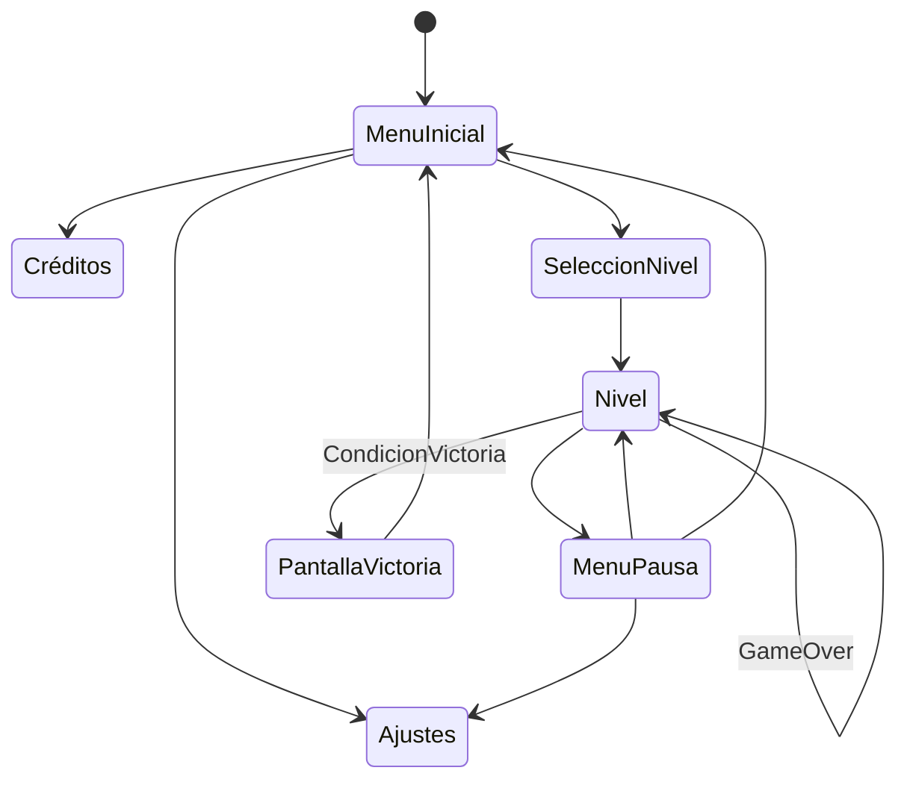

# Juegos-en-Red-G3
Repositorio para la practica de Juegos en Red del grupo 3 compuesto por Marcos Matutes, Fernando Pin, Claudia Porcuna, Óscar Rodríguez y Javier Ruibal.
## GDD 

### Índice   
1. [Introducción](#introducción)
2. [Narrativa](#narrativa)
3. [Jugabilidad](#jugabilidad)
4. [Diseño](#diseño)
5. [Sonido](#sonido)
6. [Diagrama de flujo](#diagrama-de-flujo)

### Introducción
XXXXX es un juego de puzzles y plataformar en 2D en el que el que los jugadores deberán colaborar para resolver acertijos y avanzar por una mansión. En este juego los jugadores podrán elegir entre un detective que se encargará de los retos físicos o una fantasma atada al limbo. Este juego estará dirigido a todos los públicos además de que será accesible desde la web. 

### Narrativa

### Jugabilidad

- __Objetivo del juego:__ Llegar al final de cada nivel superando obstáculos y resolviendo puzzles para avanzar al siguiente.

- __Controles:__ El jugador 1 puede controlar al detective con las teclas de A y D para moverse y W para saltar, además puede usar la tecla Q para interactuar con objetos físicos. El jugador 2 puede controlar a la chica fantasma, pudiendo usar las teclas de las flechas para moverse y saltar además de mantener la flecha hacia arriba para realizar una caida lenta y poder flotar, por último el jugador 2 puede usar el Shift Derecho para meterse en dispositivos eléctronicos para progresar mediante puzzles.

- __Mecánicas:__ El detective puede interactuar con objetos físicos como puertas y cables mientras que la chica fantasma puede meterse en dispositivos electrónicos. Ambos deberán usar sus habilidades y trabajar en equipo para avanzar en cada nivel.

- __Físicas:__ 

- __Calidad del Escenario:__ 

### Diseño
- __Estilo Visual:__ El juego tendrá un estilo visual 2D cartoon inspirado en juegos como Fireboy & Watergirl, con una estetica tétrica siguiendo la temática del juego. 

- __Color:__ Se usarán especialmente colores fríos y poco saturados ya sean tonos azulados poco saturados como grises y otros tonos similares para generar  una sensación de frialdad y hostilidad.

- __Cámara:__  Estará situada en el costado similar a los juegos de plataformas 2D de scroll lateral.

- __Inspiraciones:__ Tanto juegos de navegador como Fireboy & Watergirl.

### Sonido
- __Banda sonora:__ Como banda sonora se estará compuesta por melodías tétricas inspiradas en los temas del Pueblo Lavanda de la saga de juegos Pokemon.
- __Efectos sonoros:__ Además de música el juego contará con efectos de sonido que acompañen la jugabilidad.

### Diagrama de flujo
Diagrama de flujo sobre las diferentes pantallas y menús que dispondrá el juego, sujeto a cambios dependiendo del número de niveles que se implementen. 

