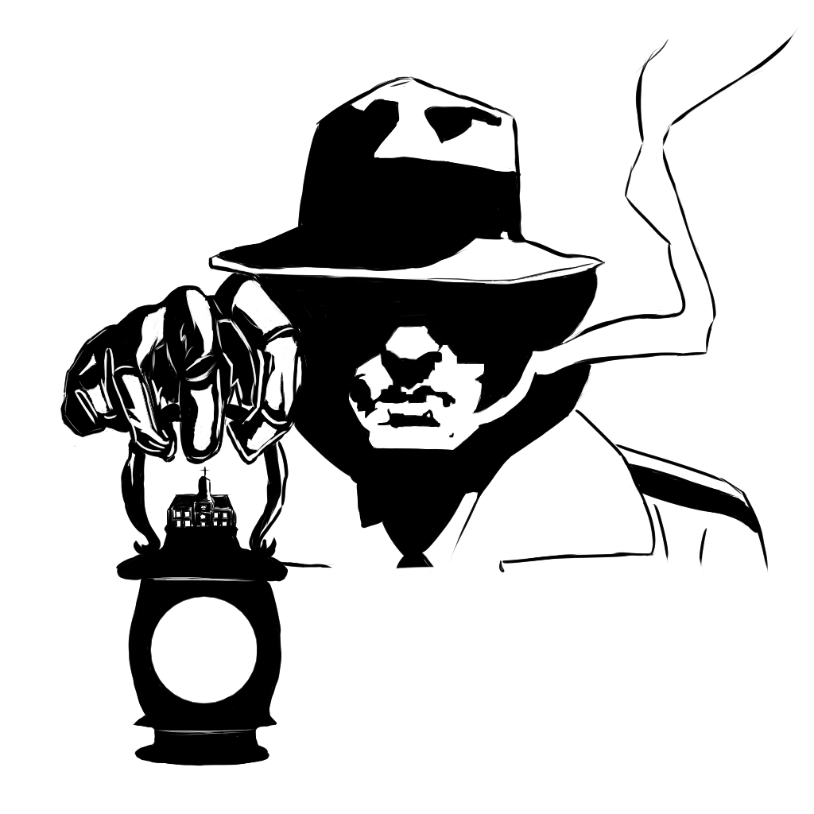
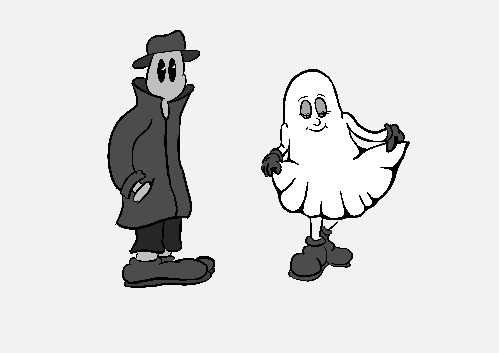
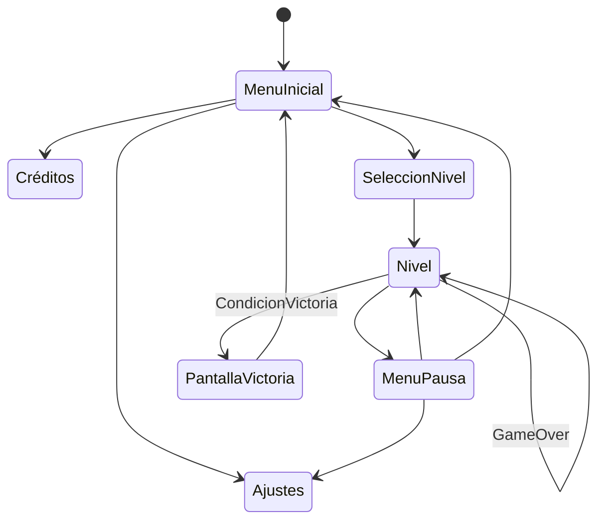

# Juegos-en-Red-G3
# BM Confidential
##### BM Confidential es un juego para dos jugadores cooperativo en el que sermeos un detective y una fantasma dentro de una mansión en los 50 y deberemos resolver el asesinato de dicha fantasma. 

##### Este proyecto ha sido realizado por el grupo 3. 
##### Integrantes: 
##### Marcos Matutes Rapún (m.matutes.2023@alumnos.urjc.es, malkoom) 
##### Fernando Pin Cubero(f.pin.2021@alumnos.urjc.es, fernan1221) 
##### Claudia Porcuna Rivas(c.porcuna.2022@alumnos.urjc.es, Clauprr) 
##### Óscar Rodríguez(o.rodriguez.2023@alumnos.urjc.es, Osquitarboss) 
##### Javier Ruibal Piñero(j.ruibal.2023@alumnos.urjc.es, HeadDoctr)

__URL del repositorio:__ https://github.com/osquitarboss/Juegos-en-Red-G3 
## Game Design Document 

### Índice   
1. [Introducción](#introducción)
2. [Narrativa](#narrativa)
3. [Jugabilidad](#jugabilidad)
4. [Diseño](#diseño)
5. [Sonido](#sonido)
6. [Diagrama de flujo](#diagrama-de-flujo)
7. [Marketing](#marketing)

## Noir Studios Presents: BM Confidential

### Introducción
BM Confidential es un juego de puzzles y plataformas en 2D en el que el que los jugadores deberán colaborar para resolver acertijos y avanzar por una mansión. En este juego los jugadores podrán elegir entre un detective que se encargará de los retos físicos o una fantasma atada al limbo. Este juego estará dirigido a todos los públicos además de que será accesible desde la web. 

### Narrativa

- __Historia del juego:__
Birmingham, Noviembre de 1953, 27 años después del asesinato del matrimonio Felton y nadie se atreve a entrar a la casa. Arthur Kentley es un detective determinado a resolver el enigma que la envuelve, impulsado por una extraña obsesión. Cuenta con la ayuda de Lucy, uno de los fantasmas residentes en la mansión. 

Tras la resolución de puzzles y pistas por la mansión Felton, se descubre que Lucy es la madre de Arthur, (quien en realidad es un Fleton), y fue ella quien le protegió de los acontecimientos 27 años atrás.  

- __Desarrollo de personajes:__ 

Arthur Kentley: siempre ha tenido un sentimiento de anhelo por la incógnita que rodea su infancia. Siendo adoptado por la familia Kentley a los 3 años. Se convierte en detective para tratar de satisfacer su ansia de respuestas.
Finalmente descubre su relación con el asesinato de los Felton, sus padres, y como su madre Lucy consiguió salvarlo a cambio de su propia vida. 

Lucy: Sentimentalmemte atrapada en la mansión donde fue asesinada, espera la llegada de su hijo Arthur mediante la conexión metal que ambos comparten. 
Tras guiar a su hijo por la mansión y a su vez, por los sucesos de la noche en la que se separaron para siempre, consigue ascender hacia el más allá, ahora segura de que Arthur podrá tener un futuro veliz atrás de los horrores que han protagonizado toda su vida.

### Jugabilidad

- __Objetivo del juego:__ Llegar al final de cada nivel superando obstáculos y resolviendo puzzles para avanzar al siguiente.

- __Controles:__ El jugador 1 puede controlar al detective con las teclas de A y D para moverse y W para saltar, puede usar la tecla Q para interactuar con objetos físicos además de a F para encender y apagar la lámpara. El jugador 2 puede controlar a la chica fantasma, pudiendo usar las teclas de las flechas para moverse y saltar además de mantener la flecha hacia arriba para realizar una caida lenta y poder flotar, por último el jugador 2 puede usar el Shift Derecho para interactuar con objetos y atacar enemigos.

- __Mecánicas:__ El detective puede interactuar con objetos físicos como puertas y cables mientras que la chica fantasma puede meterse en dispositivos electrónicos. Ambos deberán usar sus habilidades y trabajar en equipo para avanzar en cada nivel. Por otro lado, parte de la dinámica del juego es que habrá enemigos que ataquen a Arthur los cuales solo podrán ser derrotados por Lucy; además de fantasmas que atacarán a Lucy y solo Arthur podrá acabar con ellos. 

- Arthur: Iluminar con una lámpara fantasmas para defender a Lucy y abrirla paso por zonas oscuras. Interactuar con los objetos que Lucy no puede.

- Lucy: Hacer saltos más largos, atravesar algunas paredes, poseer y empujar objetos para asistir a Arthur. Proteger a Arthur de otros enemigos que le atacarán con ataques cuerpo a cuerpo.

- __Físicas:__ Gravedad que afecta a cajas, salto del personaje, personajes interactuan con cajas.

- __Escenario:__ El juego estará ambientado en una mansión de los años 50 en la que habrá diferentes puzles.

- __Gameplay Loop:__ Por todo esto, el gameplay loop sería entrar en la casa y exporar los alrederdores en un scroll lateral que progresa de izquierda a derecha. Mientras tanto, irán apareciendo enemigos por el mapa que atacarán a los jugadores. Además, para atravesar ciertos lugares se deberá cooperar para resolver algún puzzle. Finalmente, al acabar el nivel se harán descubrimientos que irán alimentando la historia y la relación de los personajes. 

### Diseño
- __Estilo Visual:__ El juego tendrá un estilo visual 2D cartoon inspirado en los primeros dibujos animados, con una estetica tétrica siguiendo la temática del juego. 

- __Color:__ Se usará una paleta con los colores blanco negro y grises siguendo la estética del cine noir.

- __Cámara:__  Estará situada en el costado similar a los juegos de plataformas 2D de scroll lateral.

- __Inspiraciones:__ Tanto juegos de navegador como Fireboy & Watergirl, como el cine noir y de misterio con ejemplos como LA Confidential o El Halcón Maltés, así como la estética de las Caricaturas de los años 30 (Oswald y Pooch).

    
  

#### Diseño de personajes: Detective y fantasma

### Sonido
- __Banda sonora:__ Como banda sonora se estará compuesta por melodías tétricas inspiradas en los temas del Pueblo Lavanda de la saga de juegos Pokemon.

- __Efectos sonoros:__ Además de música el juego contará con efectos de sonido que acompañen la jugabilidad.

### Diagrama de flujo
Diagrama de flujo sobre las diferentes pantallas y menús que dispondrá el juego, sujeto a cambios dependiendo del número de niveles que se implementen. 

### Marketing
- __Método de uso:__ En nuestro juego aplicaremos el método de uso Free 2 Play, al ser de uso en red. Por lo que perfectamente, con la distribución de videojuegos mediante las redes sociales, se beneficiaría de la capacidad de difusión viral típica de estas plataformas, sin necesidad de promoción publicitaria.

- __Modelo de Negocio:__ Usaremos un modelo Lean Canvas básico, sin el compromiso de organizar una empresa. Simplemente feedback o mejoría del juego.

